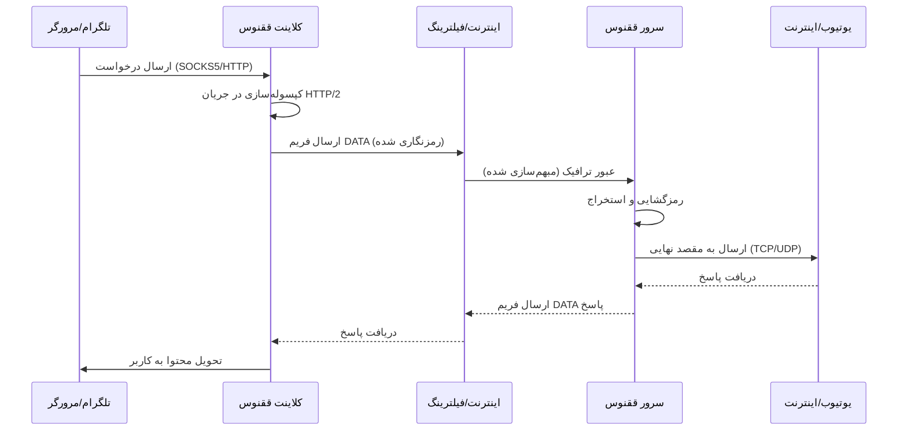

# معماری و امنیت (Architecture & Security)

::: info سطح فنی: پیشرفته
این صفحه برای کاربران حرفه‌ای و توسعه‌دهندگان طراحی شده است که می‌خواهند با جزئیات دقیق عملکرد سیستم، پروتکل‌ها و مکانیزم‌های امنیتی ققنوس آشنا شوند.
:::

## ۱. نمای کلی معماری

ققنوس (Phoenix) یک ابزار عبور از فیلترینگ است که ترافیک شبکه را درون پروتکل استاندارد **HTTP/2 (h2)** مخفی می‌کند. هدف اصلی، فریب دادن سیستم‌های بازرسی عمیق بسته (DPI) است تا ترافیک شما را به عنوان "وبگردی عادی" شناسایی کنند.

### اجزای اصلی

#### الف. لایه انتقال (Transport Layer - HTTP/2)
ما از کتابخانه استاندارد Go (`net/http`) و پکیج `golang.org/x/net/http2` برای ایجاد اتصالات پایدار استفاده می‌کنیم. برخلاف بسیاری از ابزارها که از پیاده‌سازی‌های ناقص یا سفارشی HTTP/2 استفاده می‌کنند، ققنوس دقیقاً همان Fingerprint (اثر انگشت) کلاینت‌های استاندارد Go را دارد.

*   **Multiplexing (چندگانه سازی):** تمام استریم‌های داده (مثلاً هزاران درخواست TCP جداگانه) درون یک اتصال TCP واحد Encapsulate می‌شوند. هر استریم با یک Stream ID منحصر به فرد شناسایی می‌شود. این تکنیک RTT (زمان رفت و برگشت) را برای درخواست‌های جدید به صفر می‌رساند.
*   **Header Compression (HPACK):** با استفاده از الگوریتم فشرده‌سازی HPACK، هدرهای تکراری HTTP حذف می‌شوند. این امر علاوه بر کاهش مصرف پهنای باند، تحلیل الگوهای ترافیکی بر اساس سایز هدرها را برای DPI دشوار می‌کند.
*   **Flow Control:** مکانیزم کنترل جریان HTTP/2 (در سطح اتصال و سطح استریم) به صورت خودکار نرخ ارسال داده را تنظیم می‌کند تا از ازدحام شبکه جلوگیری شود.

#### ب. لایه امنیتی (Security Layer - TLS 1.3)
تمام ارتباطات (به جز حالت Cleartext) با استفاده از **TLS 1.3** ایمن می‌شوند.
*   **Handshake:** استفاده انحصاری از TLS 1.3 باعث می‌شود تمام فرآیند تبادل کلید و احراز هویت رمزنگاری شود و SNI (نام دامنه) تنها بخش Cleartext باقی بماند (که با ECH در آینده قابل حل است).
*   **Cipher Suites:** اولویت با `TLS_CHACHA20_POLY1305_SHA256` است که روی پردازنده‌های موبایل (ARM) عملکرد بهتری نسبت به AES-GCM دارد و در برابر حملات کانال جانبی (Side-channel) مقاوم‌تر است.

---

## ۲. مدل تهدید (Threat Model)

ما امنیت را بر اساس فرضیات زیر طراحی کرده‌ایم:
1.  **Client (کلاینت):** دستگاه کاربر در محیط امن (Trusted) فرض می‌شود.
2.  **Server (سرور):** سرور ققنوس امن است و تحت کنترل کامل کاربر قرار دارد.
3.  **Network (مسیر):** شبکه بین کلاینت و سرور کاملاً ناامن (Untrusted) است.
    *   **Passive DPI:** شنود غیرفعال ترافیک برای تحلیل الگوها، زمان‌بندی و سایز بسته‌ها.
    *   **Active Probing:** تلاش فعالانه فیلترچی برای اتصال به سرور و کشف پروتکل (Replay Attack یا اسکن پورت).
    *   **MITM:** تلاش برای جایگزینی گواهی سرور با گواهی جعلی.

---

## ۳. تحلیل دقیق حالت‌های امنیتی

### الف. حالت mTLS (احراز هویت دوطرفه) - حداکثر امنیت
این پیکربندی برای مقابله با **Active Probing** طراحی شده است.

*   **Authentication (احراز هویت):** در طی TLS Handshake، سرور درخواست `Client Certificate` می‌کند. کلاینت باید گواهی خود را (که حاوی کلید عمومی Ed25519 است) ارائه دهد.
*   **Authorization (مجوزدهی):** سرور هش (Hash) کلید عمومی کلاینت را با لیست `authorized_clients` در فایل کانفیگ مقایسه می‌کند.
*   **رفتار در برابر خطا:** اگر کلاینت گواهی نامعتبر ارائه دهد یا گواهی ندهد، سرور در همان مرحله Handshake اتصال را قطع می‌کند (`bad_certificate`). این یعنی فایروال یا اسکنر نمی‌تواند حتی به لایه HTTP/2 برسد.

### ب. حالت One-Way TLS (مانند HTTPS) - امنیت استاندارد
در این حالت، احراز هویت فقط یک‌طرفه (سرور به کلاینت) است.

*   **Server Authentication:** کلاینت با استفاده از مکانیسم **Certificate Pinning** هویت سرور را تایید می‌کند. ما به جای تکیه بر CAهای عمومی (که قابل جعل توسط دولت‌ها هستند)، هش کلید عمومی سرور را مستقیماً در کلاینت پین می‌کنیم. این کار امکان هرگونه حمله MITM را به صفر می‌رساند.
*   **Client Anonymity:** کلاینت هیچ هویتی ارائه نمی‌دهد. سرور هر اتصال TLS معتبری را می‌پذیرد.

### ج. حالت h2c (متن آشکار) - مخفی‌کاری محض
پروتکل HTTP/2 Cleartext (h2c) بدون لایه رمزنگاری TLS اجرا می‌شود.

*   **Tunneled Transport:** هدف این حالت استفاده از رمزنگاری لایه بالاتر (مانند CDN Edge) است.
*   **CDN Compatibility:** از آنجا که اکثر CDNها (کلودفلر، Gcore) ارتباط با سرور Origin را می‌توانند به صورت HTTP (بدون SSL) یا با گواهی‌های Self-signed مدیریت کنند، این حالت برای مخفی کردن کامل IP سرور پشت CDN ایده‌آل است.

---

## ۴. مکانیزم‌های دفاعی فعال (Active Defense)

برای پایداری اتصال در شبکه‌هایی که دچار "اختلال عمدی" (Disruption) هستند، ققنوس از تکنیک‌های زیر بهره می‌برد:

### Connection Cycling & Hard Reset
بسیاری از سیستم‌های فیلترینگ پس از مدتی (مثلاً ۶۰ ثانیه) یا حجم مشخصی از داده، اتصال TCP را مختل می‌کنند (Packet Drop).
*   **تشخیص:** کلاینت به طور مداوم خطاهای لایه Transport (مانند Timeout یا EOF غیرمنتظره) را پایش می‌کند.
*   **واکنش:** به محض تشخیص ناپایداری (۳ خطا در بازه کوتاه)، کلاینت یک **Hard Reset** انجام می‌دهد.
*   **بازسازی:** کل استخر اتصالات (`ClientConn` در Go) بسته شده، سوکت‌های TCP بسته می‌شوند و یک Handshake جدید آغاز می‌شود. این کار باعث تغییر احتمالی مسیر مسیریابی یا پورت مبدا شده و اختلال را دور می‌زند.

### رمزنگاری Ed25519
ما برای تمام عملیات امضا و تولید کلید از **Ed25519** استفاده می‌کنیم (Curve25519 برای تبادل کلید TLS).
*   **عملکرد:** کلیدهای عمومی بسیار کوتاه (۳۲ بایت) و عملیات امضای فوق‌سریع.
*   **امنیت:** امنیت معادل RSA-3072 اما با سرعت بسیار بالاتر و بدون آسیب‌پذیری‌های Padding که در RSA وجود دارد.

---

## ۵. بهترین روش‌های امنیتی (Best Practices)

1.  **استفاده از mTLS:** اگر سرور شخصی دارید، حتماً از mTLS استفاده کنید تا سرور شما در برابر اسکنرهای اینترنتی "نامرئی" باشد.
2.  **چرخش کلیدها (Key Rotation):** هرچند رمزنگاری ما قوی است، اما لو رفتن کلید خصوصی سرور می‌تواند امنیت را به خطر بیندازد. پیشنهاد می‌شود هر ۳ ماه یکبار کلیدها را عوض کنید.
3.  **ترکیب با CDN:** برای جلوگیری از شناسایی IP سرور، استفاده از حالت h2c یا One-Way TLS پشت یک CDN معتبر توصیه می‌شود.
