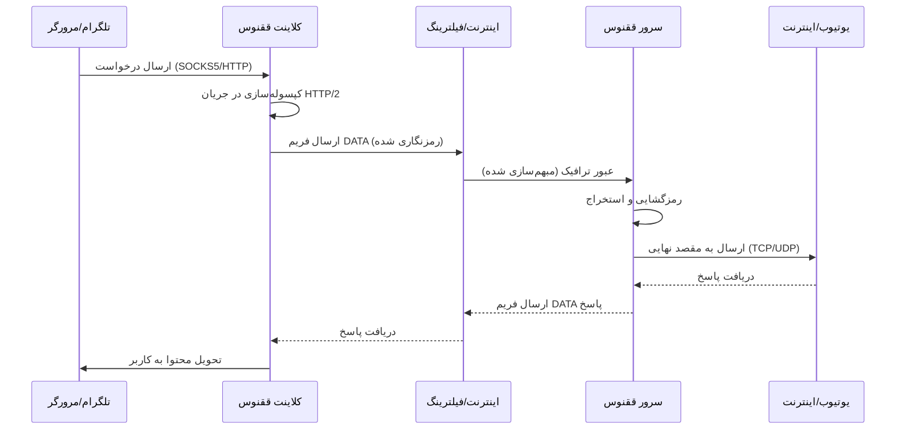

# معماری ققنوس (Architecture)

## نمای کلی
ققنوس (Phoenix) ابزاری قدرتمند برای عبور از فیلترینگ پیشرفته با استفاده از **HTTP/2 (h2) multiplexing** است.

برخلاف VPNهای سنتی (مثل WireGuard یا OpenVPN) که پروتکل‌های امضاءدار دارند، ققنوس دقیقاً شبیه ترافیک عادی وب (مرورگرها) رفتار می‌کند. این کار سیستم‌های DPI را فریب می‌دهد.

## اجزای اصلی

### ۱. لایه انتقال (Transport Layer - HTTP/2)
ققنوس از کتابخانه استاندارد Go برای ایجاد اتصالات پایدار استفاده می‌کند.
- **Multiplexing:** چندین جریان منطقی (مثل درخواست‌های تلگرام و مرورگر) همگی داخل **یک** اتصال TCP منتقل می‌شوند. این کار سرعت را به شدت بالا می‌برد و سربار Handshake را کم می‌کند.
- **Header Compression (HPACK):** سربار پیام‌های کنترلی تا ۹۹٪ کاهش می‌دهد.
- **Flow Control:** توزیع عادلانه پهنای باند بین استریم‌ها.

### ۲. لایه امنیتی (Security Layer - TLS / mTLS)
ققنوس سه حالت امنیتی دارد:

1.  **mTLS (احراز هویت دوطرفه) - حداکثر امنیت:**
    - سرور و کلاینت **هر دو** یکدیگر را تایید می‌کنند.
    - از کلید **Ed25519** استفاده می‌شود.
    - کلاینت کلید عمومی سرور را پین می‌کند (Pinning) (بدون نیاز به Authority مرکزی).
    - سرور فقط به کلاینت‌های مجاز سرویس می‌دهد.
    - **مقاوم در برابر Probing:** سرور به درخواست‌های ناشناس پاسخ نمی‌دهد.

2.  **One-Way TLS (مانند HTTPS) - امنیت استاندارد:**
    - سرور کلید خصوصی دارد و گواهی می‌دهد.
    - کلاینت سرور را تایید می‌کند (Pinning) تا MITM رخ ندهد.
    - کلاینت **ناشناس** است (هر کسی می‌تواند وصل شود).
    - **کاربرد:** پراکسی عمومی، اشتراک‌گذاری با دوستان.

3.  **h2c (بدون رمزنگاری - Cleartext):**
    - بدون رمزنگاری لایه TLS.
    - طراحی شده برای پشت **Reverse Proxy (Nginx)** یا **CDN (Cloudflare)**.
    - **کاربرد:** مخفی شدن پشت CDNهای بزرگ برای جلوگیری از بلاک شدن IP.

### ۳. مکانیزم ارتجاعی (Resilience / Self-Healing)
ققنوس به طور فعال با اختلالات شبکه مبارزه می‌کند:

- **چک سلامت اتصال (Health Check):**
  - کلاینت به طور مداوم خطاهای اتصال را می‌شمارد.
  - اگر ۳ خطای متوالی رخ دهد، اتصال "ناپایدار" علامت‌گذاری می‌شود.

- **ریست سخت (Hard Reset & Circuit Breaker):**
  - در صورت ناپایداری، کلاینت یک **Hard Reset** انجام می‌دهد.
  - کل `http.Client` و استخر اتصالات TCP دور ریخته شده و یک نمونه جدید ساخته می‌شود.
  - این کار باعث می‌شود DNS جدید و Handshake تازه انجام شود (دور زدن اختلالات موقت).
  - **Debounce:** برای جلوگیری از حملات "Reset Storm"، ریست فقط هر ۵ ثانیه یکبار مجاز است.

## نمودار جریان داده (Data Flow)

