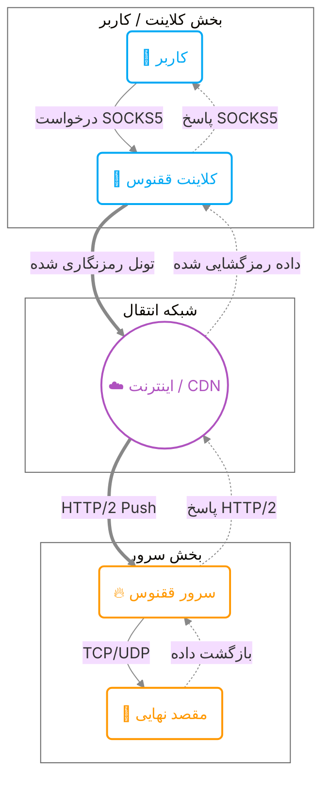

# معرفی و کلیات ققنوس (Phoenix)

به مستندات ققنوس خوش آمدید.
در اینجا با مفاهیم پایه، معماری و حالت‌های امنیتی ققنوس آشنا می‌شوید تا بتوانید بهترین تنظیمات را برای نیاز خود انتخاب کنید.

## ققنوس چیست؟

ققنوس ابزاری تخصصی برای دور زدن فیلترینگ‌های پیشرفته و سیستم‌های بازرسی عمیق بسته (DPI) است. برخلاف VPNهای معمولی، ققنوس ترافیک شما را در دل پروتکل استاندارد **HTTP/2** مخفی می‌کند.

### چرا HTTP/2؟
پروتکل HTTP/2 همان زبانی است که مرورگر شما برای باز کردن سایت‌هایی مثل گوگل و اینستاگرام استفاده می‌کند. با استفاده از این پروتکل:
1.  ترافیک شما کاملاً شبیه ترافیک وبگردی عادی به نظر می‌رسد.
2.  از قابلیت **Multiplexing** برای ارسال همزمان چندین درخواست (تلگرام، یوتوب، وبگردی) روی **یک** اتصال TCP استفاده می‌شود که سرعت را به شدت بالا می‌برد.
3.  **Header Compression (HPACK):** سربار پیام‌های کنترلی را تا ۹۹٪ کاهش می‌دهد.
4.  **Flow Control:** توزیع عادلانه پهنای باند بین استریم‌ها را ممکن می‌سازد.

---

## حالات امنیتی (Security Modes)

::: tip خلاصه برای کاربران
در این بخش، حالت‌های امنیتی به زبان ساده و بدون پیچیدگی‌های فنی توضیح داده شده‌اند. اگر علاقه‌مند به جزئیات فنی دقیق‌تر هستید، لطفاً به صفحه **[معماری و امنیت](architecture.md)** مراجعه کنید.
:::

ققنوس سه سطح امنیتی مختلف را پشتیبانی می‌کند.
**پیشنهاد اکید ما استفاده از حالت mTLS یا حداقل One-Way TLS است.**

::: info نکته مهم در مورد سرعت
سرعت هیچ کدام از حالت‌های امنیتی زیر با یکدیگر تفاوتی ندارد. هر سه حالت (حتی mTLS با وجود امنیت بسیار بالا) با حداکثر کارایی و سرعت طراحی شده‌اند و هیچ سربار اضافی احساس نخواهید کرد.
:::

::: tip سازگاری با CDN
تمام حالت‌های زیر (mTLS، One-Way TLS و Cleartext) قابلیت استفاده پشت سرویس‌های CDN (مانند Cloudflare، Gcore و ...) را دارند.
:::

### ۱. حالت mTLS (احراز هویت دوطرفه) - 🛡️ پیشنهاد شده
*   **امنیت:** بسیار بالا
*   **ویژگی‌های اصلی:**
    *   از حملات مرد میانی (MITM) و شنود کاملاً جلوگیری می‌کند.
    *   تضمین می‌کند که تنها کلاینت‌هایی که در سرور مجاز تعریف شده‌اند متصل شوند.
    *   از اتصال کلاینت‌های دیگری که حتی Public Key سرور را دارند (اما کلید خصوصی کلاینت مجاز را ندارند) جلوگیری می‌کند.

### ۲. حالت One-Way TLS (مانند HTTPS) - 🔒
*   **امنیت:** متوسط
*   **ویژگی‌های اصلی:**
    *   عدم نیاز به تعریف تک‌تک کلاینت‌ها در سرور (سهولت اشتراک‌گذاری کانفیگ با تعداد زیادی کاربر).
    *   محافظت از سرور در برابر اتصال کلاینت‌های دیگر که فقط آدرس سرور را دارند (سرور به اتصال‌های غیرمعتبر پاسخ نمی‌دهد).

### ۳. حالت امن‌نبوده (Cleartext / h2c) - ⚠️
*   **امنیت:** هیچی
*   **ویژگی‌های اصلی:**
    *   با استفاده از این حالت امنیتی به همگان ثابت می‌کنید که دیوانه‌ای هستید که در این دنیای ترسناک مانند جوجه ماشینی‌ها به آغوش گربه‌های گرسنه می‌روید.

---

## معماری کلی

در مرحله بعد، نحوه **نصب و راه‌اندازی** قدم‌به‌قدم را خواهید دید.
