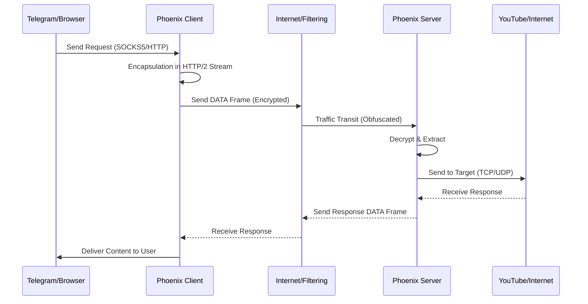

# Architecture & Security

::: info Technical Level: Advanced
This page is designed for professional users and developers who want to understand the precise system operation, protocols, and security mechanisms of Phoenix in detail.
:::

## 1. Architecture Overview

Phoenix is a censorship circumvention tool that hides network traffic inside the standard **HTTP/2 (h2)** protocol. The main goal is to deceive Deep Packet Inspection (DPI) systems into identifying your traffic as "normal web browsing".

### Main Components

#### A. Transport Layer (HTTP/2)
We use the standard Go library (`net/http`) and `golang.org/x/net/http2` package to establish persistent connections. Unlike many tools that use incomplete or custom HTTP/2 implementations, Phoenix has exactly the same Fingerprint as standard Go clients.

*   **Multiplexing:** All data streams (e.g. thousands of separate TCP requests) are Encapsulated within a single, long-lived TCP connection. Each stream is identified by a unique Stream ID. This technique reduces RTT (Round Trip Time) for new requests to zero.
*   **Header Compression (HPACK):** By using the HPACK compression algorithm, repetitive HTTP headers are eliminated. This not only reduces bandwidth consumption but also makes traffic pattern analysis based on header sizes difficult for DPI.
*   **Flow Control:** The HTTP/2 flow control mechanism (at connection and stream levels) automatically adjusts data transmission rate to prevent network congestion.

#### B. Security Layer (TLS 1.3)
All communications (except Cleartext mode) are secured using **TLS 1.3**.
*   **Handshake:** Exclusive use of TLS 1.3 ensures the entire key exchange and authentication process is encrypted, leaving only SNI (Domain Name) as Cleartext (which can be solved with ECH in the future).
*   **Cipher Suites:** Priority is given to `TLS_CHACHA20_POLY1305_SHA256`, which performs better on mobile processors (ARM) than AES-GCM and is more resistant to Side-channel attacks.

---

## 2. Threat Model

We have designed security based on the following assumptions:
1.  **Client:** The user's device is assumed Trusted.
2.  **Server:** The Phoenix server is secure and under full user control.
3.  **Network:** The path between client and server is completely Untrusted.
    *   **Passive DPI:** Passive traffic eavesdropping to analyze patterns, timing, and packet sizes.
    *   **Active Probing:** Active attempts by censors to connect to the server and discover the protocol (Replay Attack or Port Scan).
    *   **MITM:** Attempts to replace the server certificate with a fake one.

---

## 3. Detailed Security Modes Analysis

### A. mTLS Mode (Mutual Authentication) - Maximum Security
This configuration is designed to counter **Active Probing**.

*   **Authentication:** During the TLS Handshake, the server requests a `Client Certificate`. The client must present its certificate (containing the Ed25519 public key).
*   **Authorization:** The server compares the Hash of the client's public key with the `authorized_clients` list in the config file.
*   **Error Behavior:** If the client presents an invalid certificate or no certificate, the server terminates the connection at the Handshake stage (`bad_certificate`). This means the firewall or scanner cannot even reach the HTTP/2 layer.

### B. One-Way TLS Mode (Like HTTPS) - Standard Security
In this mode, authentication is one-way (Server to Client) only.

*   **Server Authentication:** The client verifies the server's identity using **Certificate Pinning**. Instead of relying on public CAs (which can be forged by governments), we pin the server's public key hash directly in the client. This reduces the possibility of any MITM attack to zero.
*   **Client Anonymity:** The client presents no identity. The server accepts any valid TLS connection.

### C. Insecure Mode (Cleartext / h2c) - Pure Stealth
HTTP/2 Cleartext (h2c) protocol runs without a TLS encryption layer.

*   **Tunneled Transport:** The goal of this mode is to use higher-layer encryption (like CDN Edge).
*   **CDN Compatibility:** Since most CDNs (Cloudflare, Gcore) can manage communication with the Origin server via HTTP (without SSL) or with Self-signed certificates, this mode is ideal for completely hiding the server IP behind a CDN.

---

## 4. Active Defense Mechanisms

To maintain connection stability in networks suffering from "intentional disruption" (Disruption), Phoenix utilizes the following techniques:

### Connection Cycling & Hard Reset
Many filtering systems disrupt the TCP connection (Packet Drop) after some time (e.g. 60 seconds) or a certain volume of data.
*   **Detection:** The client continuously monitors Transport layer errors (like Timeout or unexpected EOF).
*   **Reaction:** Upon detecting instability (3 errors in a short interval), the client performs a **Hard Reset**.
*   **Reconstruction:** The entire connection pool (`ClientConn` in Go) is closed, TCP sockets are closed, and a new Handshake begins. This forces a potential routing or source port change, bypassing the disruption.

### Ed25519 Cryptography
We use **Ed25519** for all signing and key generation operations (Curve25519 for TLS key exchange).
*   **Performance:** Very short public keys (32 bytes) and ultra-fast signing operations.
*   **Security:** Security equivalent to RSA-3072 but with much higher speed and without Padding vulnerabilities present in RSA.

---

## 5. Security Best Practices

1.  **Use mTLS:** If you have a personal server, strictly use mTLS so your server is "invisible" to internet scanners.
2.  **Key Rotation:** Although our encryption is strong, leaking the server's private key can compromise security. It is recommended to change keys every 3 months.
3.  **Combine with CDN:** To prevent server IP identification, using h2c or One-Way TLS mode behind a reputable CDN is recommended.
