# Introduction and Overview (Phoenix)

Welcome to the Phoenix documentation.
Here you will learn about the basic concepts, architecture, and security modes of Phoenix so you can choose the best configuration for your needs.

## What is Phoenix?

Phoenix is a specialized tool for bypassing advanced filtering and Deep Packet Inspection (DPI) systems. Unlike conventional VPNs, Phoenix hides your traffic within the standard **HTTP/2** protocol.

### Why HTTP/2?
HTTP/2 is the same language your browser uses to open sites like Google and Instagram. By using this protocol:
1. Your traffic looks completely like normal web browsing traffic.
2. It uses **Multiplexing** to send multiple requests (Telegram, YouTube, Web Browsing) simultaneously over **one** TCP connection, significantly increasing speed.
3. **Header Compression (HPACK):** Reduces control message overhead by up to 99%.
4. **Flow Control:** Enables fair bandwidth distribution among streams.

---

## Security Modes

::: tip Summary for Users
In this section, security modes are explained simply and without technical complexities. If you are interested in more precise technical details, please visit the **[Architecture & Security](architecture.md)** page.
:::

Phoenix supports three different security levels.
**We strongly recommend using mTLS mode or at least One-Way TLS.**

::: info Important Note on Speed
None of the security modes below differ in speed. All three modes (even mTLS despite high security) are designed for maximum efficiency and speed, and you will feel no extra overhead.
:::

::: tip CDN Compatibility
All modes below (mTLS, One-Way TLS, and Cleartext) are capable of being used behind CDN services (like Cloudflare, Gcore, etc.).
:::

### 1. mTLS Mode (Mutual Authentication) - 🛡️ Recommended
*   **Security:** Very High
*   **Main Features:**
    *   Completely prevents Man-in-the-Middle (MITM) attacks and eavesdropping.
    *   Ensures that only clients defined as authorized on the server can connect.
    *   Prevents connection of other clients who even have the server's Public Key (but not the authorized client's private key).

### 2. One-Way TLS Mode (Like HTTPS) - 🔒
*   **Security:** Medium
*   **Main Features:**
    *   No need to define individual clients on the server (ease of sharing config with many users).
    *   Protects the server against other clients who only have the server address (server does not respond to invalid connections).

### 3. Insecure Mode (Cleartext / h2c) - ⚠️
*   **Security:** None
*   **Main Features:**
    *   By using this security mode, you prove to everyone that you are a maniac who goes into the embrace of hungry cats like a machine chick in this scary world.

---

## General Architecture

```mermaid
%%{init: {'theme': 'base', 'themeVariables': { 'fontSize': '16px', 'fontFamily': 'Inter', 'lineColor': '#888888', 'mainBkg': 'transparent', 'clusterBkg': 'none', 'clusterBorder': '#666'}}}%%
flowchart TD
    subgraph ClientSide [Client Side]
        direction TB
        User(👤 User)
        Client(🚀 Phoenix Client)
    end

    subgraph Cloud [Transport Network]
        Internet((☁️ Internet / CDN))
    end

    subgraph ServerSide [Server Side]
        direction TB
        Server(🔥 Phoenix Server)
        Target(🎯 Target Destination)
    end

    %% Request Path
    User -->|SOCKS5 Request| Client
    Client ==>|Encrypted Tunnel| Internet
    Internet ==>|HTTP/2 Push| Server
    Server -->|TCP/UDP| Target

    %% Response Path
    Target -.->|Data Back| Server
    Server -.->|HTTP/2 Response| Internet
    Internet -.->|Decrypted Data| Client
    Client -.->|SOCKS5 Reply| User

    %% Adaptive Styles
    classDef client fill:none,stroke:#03a9f4,stroke-width:2px,color:#03a9f4;
    classDef server fill:none,stroke:#ff9800,stroke-width:2px,color:#ff9800;
    classDef internet fill:none,stroke:#af52bf,stroke-width:2px,color:#af52bf;
    
    class Client,User client;
    class Server,Target server;
    class Internet internet;
```

In the next step, you will see the step-by-step **Installation and Setup**.
